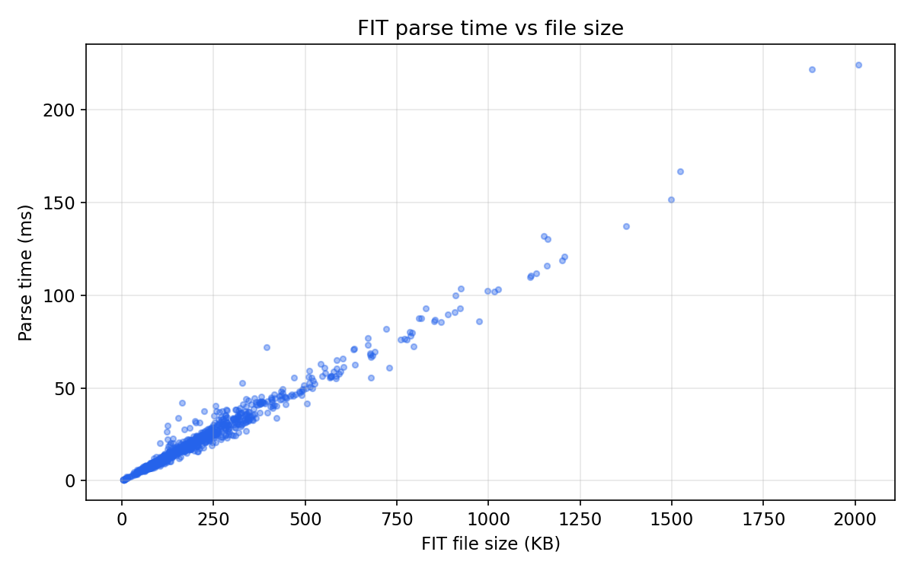
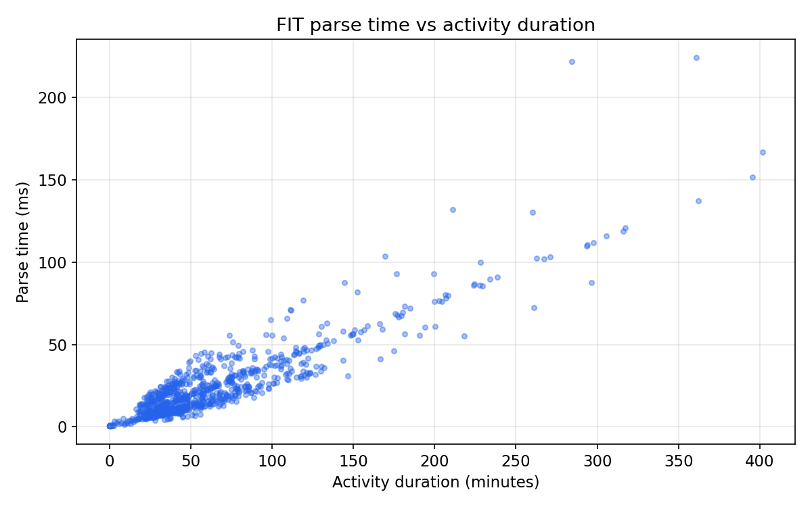
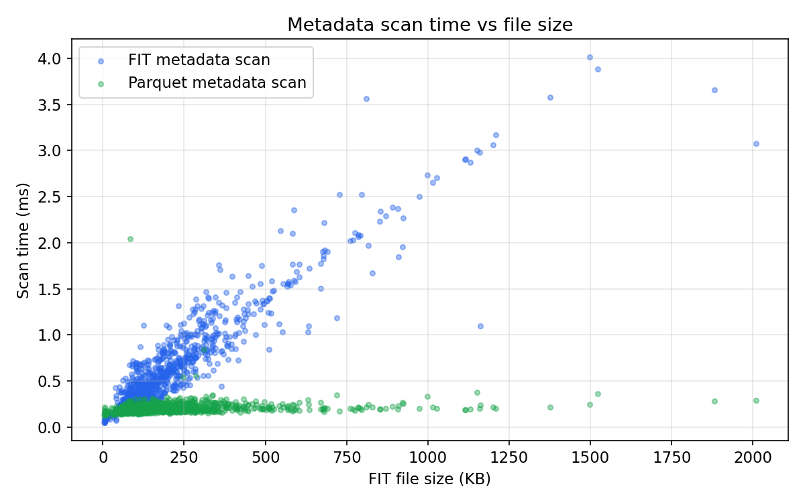
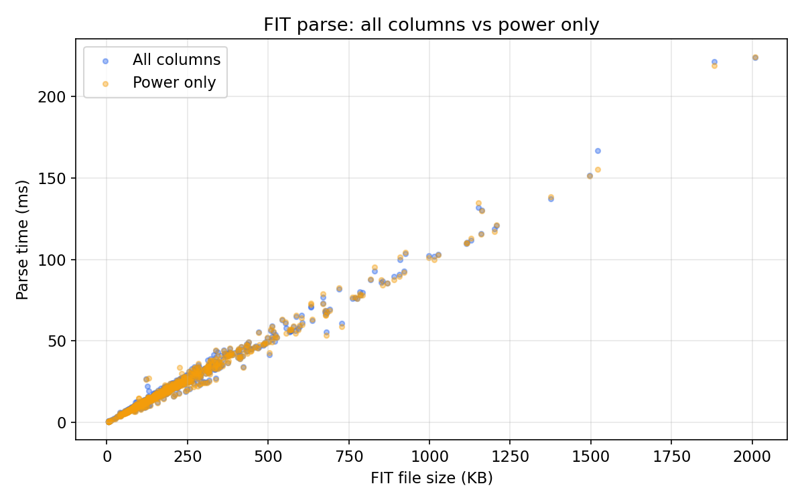
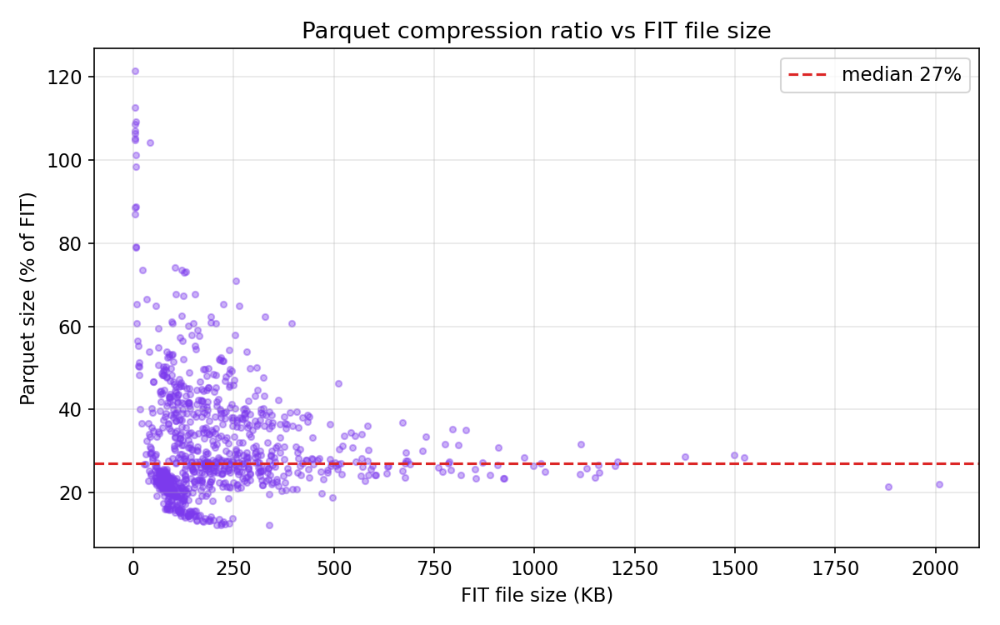

# Benchmark

Single-file performance across **963** real activities (3,548,854 total rows).

## Environment

| | |
|---|---|
| CPU | Apple M1 Pro |
| RAM | 32 GB |
| Disk | APPLE SSD AP2048R (internal SSD) |
| OS | macOS 26.3.1 |
| Python | 3.10.10 |
| PyArrow | 23.0.1 |

All files read from and written to the internal SSD. No network I/O.
Each operation is measured once per file (no repeated iterations) across
963 files to capture real-world variance.

## Dataset

| | |
|---|---|
| Activities | 963 |
| Total rows | 3,548,854 |
| Total FIT size | 217 MB |
| Total Parquet size | 80 MB (38% median compression) |

## Summary

| Operation | median | p5 | p95 | max |
|---|--:|--:|--:|--:|
| **FIT full parse** | **17 ms** | 5.2 ms | 63 ms | 224 ms |
| **FIT metadata scan** | **0.49 ms** | 0.18 ms | 1.7 ms | 4.0 ms |
| **Parquet full load** | **1.4 ms** | 0.90 ms | 2.6 ms | 5.5 ms |
| **Parquet metadata scan** | **0.20 ms** | 0.15 ms | 0.28 ms | 2.0 ms |
| **Parquet write** | **2.2 ms** | 1.2 ms | 5.3 ms | 14 ms |

### Parquet vs FIT speedup

| Operation | median speedup |
|---|--:|
| Full load | **12x** |
| Metadata scan | **2x** |

## FIT parse time vs file size

Parse time scales linearly with file size. The Rust parser decodes every
binary field in a single pass, so larger files take proportionally longer.

## FIT parse time vs activity duration

Longer activities produce more records and larger files. A 1-hour cycling
ride (~200 KB FIT) parses in ~15 ms; a 6-hour hike (~1 MB) takes ~100 ms.

## Metadata scan time vs file size

FIT metadata scan reads binary message headers and scales with file size.
Parquet metadata scan reads only the schema footer (last few bytes of the
file) — effectively O(1) regardless of how large the file is.

## Column projection: all columns vs power only

Tested on the **706** activities that have power data.

Loading only `["timestamp", "power"]` instead of all 12 columns:

| Load mode | FIT median | Parquet median |
|---|--:|--:|
| All columns | 18 ms | 1.4 ms |
| Power only | 18 ms | 0.94 ms |

FIT parse time is nearly identical — the Rust decoder must read the full
binary stream regardless, and column selection only drops unwanted columns
after parsing. The cost is dominated by binary decoding, not Arrow
construction.

Parquet benefits significantly from column projection because only the
requested column chunks are read from disk. The remaining columns are
never touched.

## Compression

Parquet with ZSTD compression is typically 25-35% of the original FIT file
size. Smaller FIT files compress less efficiently due to fixed overhead
(schema, metadata). Larger files converge toward ~25%.

---

*Generated by `scripts/benchmark.py`*
